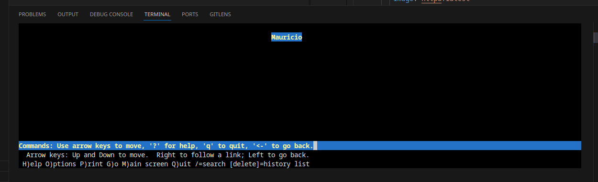
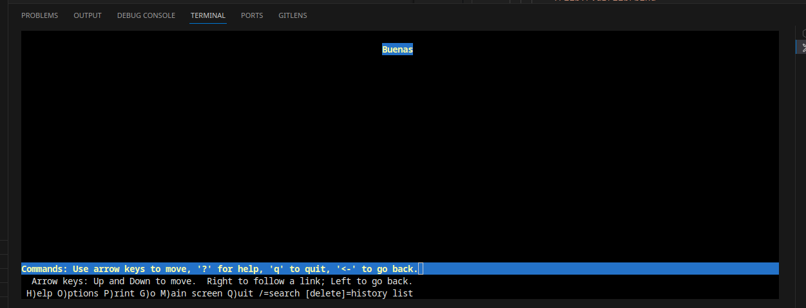

# Se añade un DNS al Docker Compose y se colocan IPs fijas a los contenedores. Además se le coloca el prefijo ***"asir_"*** al nombre de los contenedores

# El DNS resuelve dos dominios a la IP del apache:

# Se configuran dos Virtual-Hosts separados para cada dominio en el mismo puerto (2000)

En el segundo host se emplea la directiva de **DirectoryIndex** para indicarle al host que el **"Index"** se llamará ***"hola.html"***

Para comprobar que existe el host virtual podemos utilizar el comando ***Lynx***. El cual es un navegador web basado en texto que se puede utilizar dentro de la consola

Se utilizan los siguientes comandos:

***El 2000 es el puerto asignado***

    lynx www.fabulasoscuras.int:2000

    lynx www.fabulasmaravillosas.int:2000

